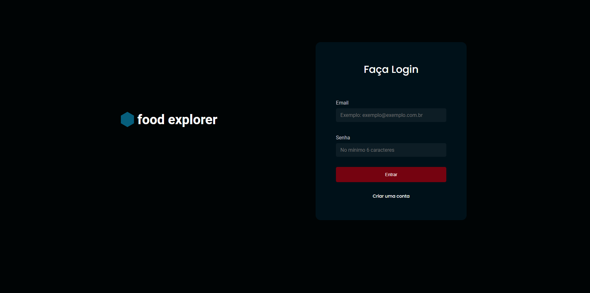
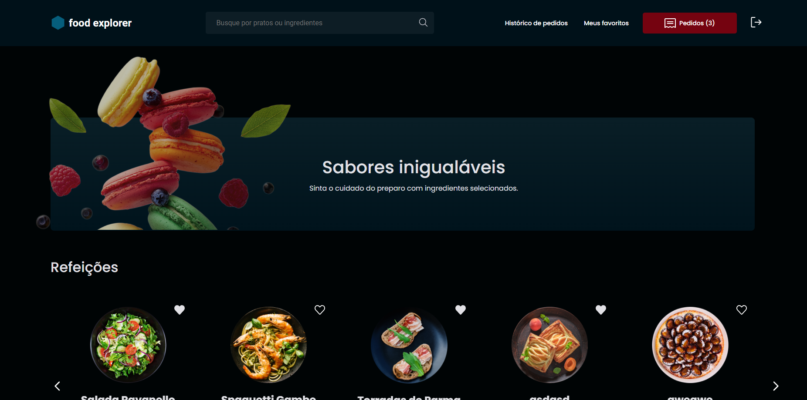
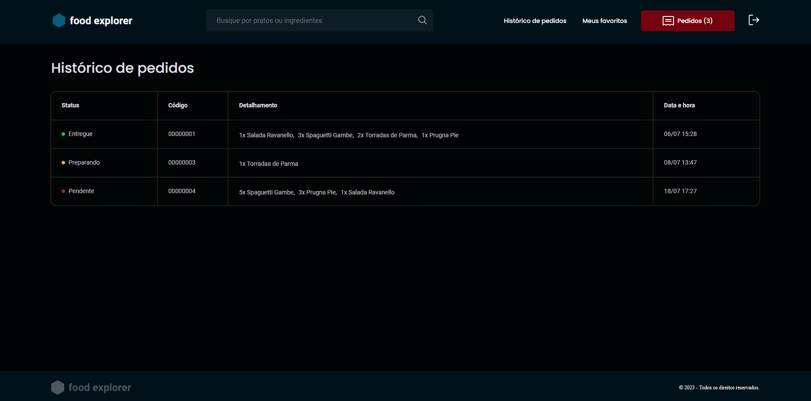
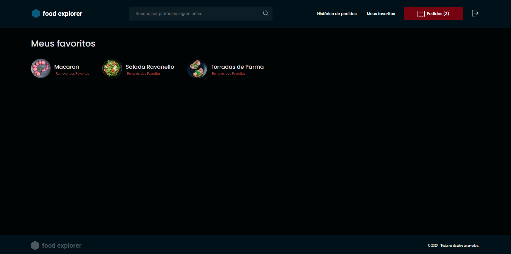

# foodexplorer-frontend

## Descrição do Projeto
<p align="center">Uma aplicação web para cadastro de usuários e vizualização de cardápio.</p>

##Preview
<p align="center">
  
  
  
  
</p>

## Funcionalidades

- Autenticação JWT

- O food explorer terá duas personas: o admin e o usuário;

- O admin é a pessoa responsável pelo restaurante, logo, poderá criar, visualizar, editar e apagar um prato a qualquer momento. Cada prato deve conter uma imagem, um nome, uma categoria, uma breve descrição, os ingredientes e o seu preço. Ao clicar em adicionar prato, o admin receberá uma mensagem de sucesso e será redirecionado para a página principal;

- O usuário irá visualizar todos os pratos cadastrados e, quando clicar em um prato, será redirecionado para uma nova tela com informações mais detalhadas sobre ele.

- Usuário e admin podem fazer uma busca tanto pelo nome do prato quanto pelos ingredientes;

- O usuário poderá marcar um prato como favorito, basta clicar no coração que aparece ao lado de cada um;

- O usuário poderá incluir itens no carrinho, clicando no botão incluir. Já a quantidade é controlada pelos botões “-” e “+”.

- O usuário poderá excluir um prato do carrinho e o valor total do pedido deve ser atualizado automaticamente.

- Ao clicar no botão meu pedido, o usuário será redirecionado para uma tela onde irá ver o seu pedido, a soma e os métodos de pagamento.(Obs: Os metódos de pagamento não estão funcionando, para prosseguir com o pedido basta selecionar a forma de pagamento "Crédito" e clicar em finalizar pagamento, não é necessário preencher nenhum campo.)

- O admin irá visualizar e controlar o status de cada pedido, por um campo do tipo select. Os pedidos irão aparecer em uma tabela ao clicar em Pedidos;


## Pré-requisitos

Antes de começar, você vai precisar ter instalado em sua máquina as seguintes ferramentas:
[Git](https://git-scm.com), [Node.js](https://nodejs.org/en/). 
Além disto é bom ter um editor para trabalhar com o código como [VSCode](https://code.visualstudio.com/)

### 🎲 Rodando o Front End (web)

# Clone este repositório
```bash
$ git clone https://github.com/betobala/foodexplorer-frontend.git
```

# Configure a API

- Acesse a pasta src/services/api.js e altere o campo baseURL, por padrão ele terá o valor "http://localhost:3333"


# Instale as dependências
```bash
$ npm install
```

# Execute a aplicação em modo de desenvolvimento
```bash
$ npm run dev
```


